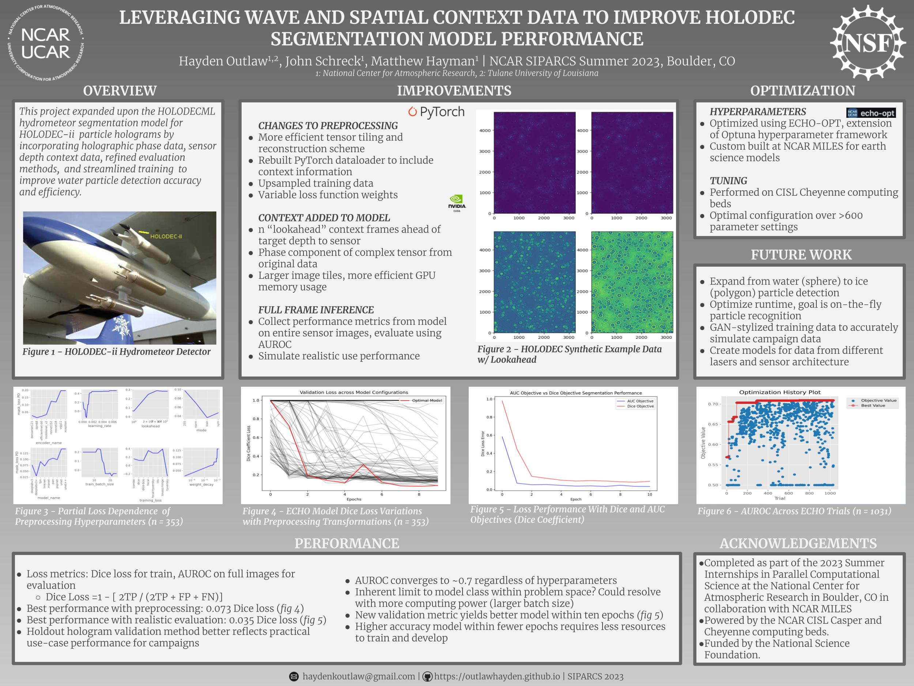

# Publications

# Presentations
## American Meteorological Society
### Baltimore, MD - January 2024 *PENDING*

- For American Meteorological Society national conference.
- Presented findings from progress in Summer Internships In Parallel Computational Science at the National Center for Atmospheric Research.

## National Center for Atmospheric Research SIPARCS Seminar
### Boulder, CO - August 2023

- For Summer Internships In Parallel Computational Science at the National Center for Atmospheric Research.
- Presented progress in improved hydrometeor segmentation model. In collaboration with NOAA and NCAR staff scientists.

<iframe width="560" height="315" src="https://www.youtube.com/embed/edqQrgZR2-c?si=Qu_R-Z9f6rlQbEJU" title="YouTube video player" frameborder="0" allow="accelerometer; autoplay; clipboard-write; encrypted-media; gyroscope; picture-in-picture; web-share" allowfullscreen></iframe>

## SIAM Algebraic Geometry 2023 Conference
### Eindhoven, NL - July 2023

- For Society of Industrial and Applied Mathematics Algebraic Geometry 2023 Conference, on behalf of Tulane University Mathematics.
- Presented novel numeric model of probability function for existence of graphLasso covariance estimator in low-sample scenarios.
